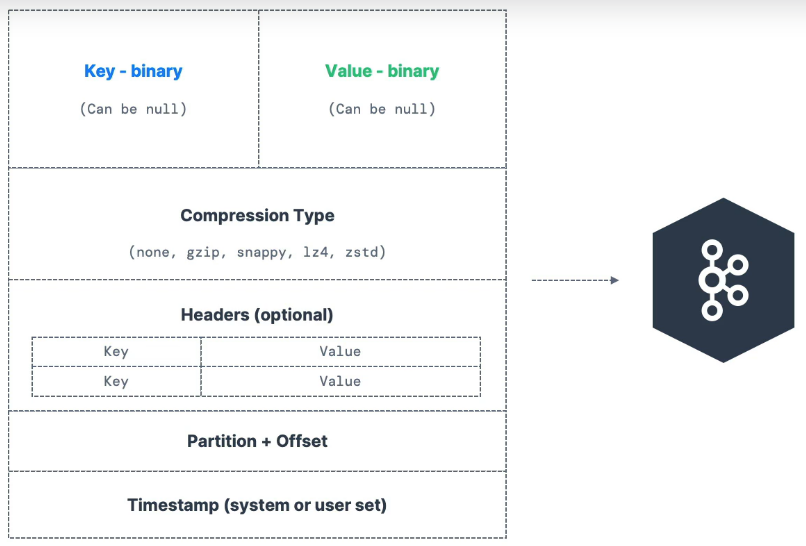
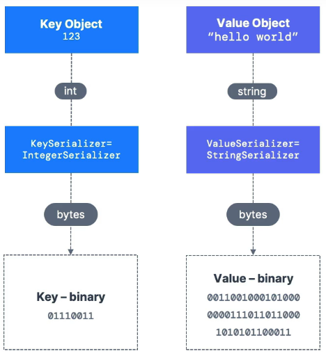
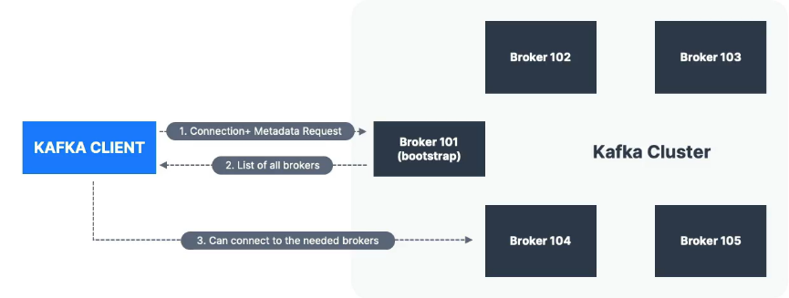
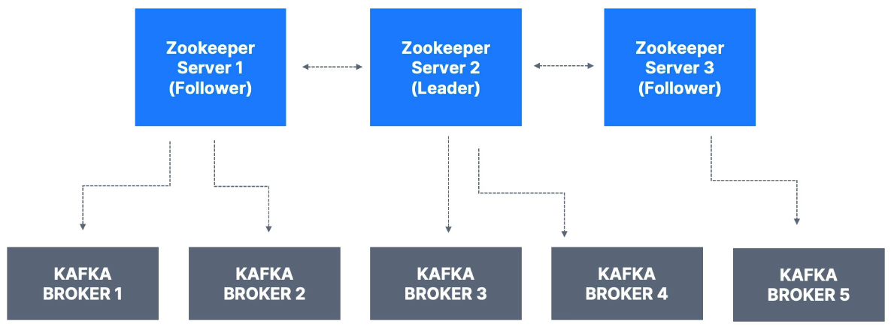

## About The Project

- Apache Kafka Series - Learn Apache Kafka for Beginners v3
- START HERE: Learn Apache Kafka 3.0 Ecosystem, Core Concepts, Real World Java Producers/Consumers & Big Data Architecture
- [Stephane Maarek ](https://github.com/simplesteph)
- [Original Repo](https://github.com/conduktor/kafka-beginners-course)
- [conduktor](https://www.conduktor.io/)
- [Course Resources](https://www.conduktor.io/apache-kafka-for-beginners)

&nbsp;

---

&nbsp;

## Introduction


- If you have 4 **source systems**, and 6 **target systems**, you need to write 24 **integrations**
- Each integration comes with difficulties around
  - **Protocol:** how the data is transported (TCP, HTTP, REST, FTP, JDBC)
  - **Data format:** how the data is parsed (Binary, CSV, JSON, Avro, Protobuf)
  - Data schema & evolution: how the data is shaped and may change
- Each source system will have an increased load from the connections


&nbsp;


## Use-cases

- **Kafka is only used as a transportation mechanism**
- Messaging System
- Activity Tracking
- Gather metrics from many different locations
- Application Logs gathering
- Stream processing (with the Kafka Streams API for example)
- De-coupling of system dependencies
- Integration with Spark, Flink, Storm, Hadoop, and many other Big Data technologies
- Micro-services pub/sub


## Topics

- A particular stream of data
- Like a table in a database (without all the constraints)
- You can have as many topics as you want
- A topic is identified by its **name**
- Any kind of message format
- The sequence of messages is called a **data stream**
- You cannot query topics, instead, use Kafka Producers to send data and Kafka Consumers to read the data

### Partitions and offsets

- Topics are split in **partitions**
  - Messages within each partition are ordered
  - Each message within a partition gets an incremental id, called **offset**
- **Immutable**
- Data is kept only for a limited time (default is one week - configurable)
- Offset only have a meaning for a specific partition
  - E.g. offset 3 in partition 0 doesn't represent the same data as offset 3 in partition 1
  - Offsets are not re-used even if previous messages have been deleted
- Order is guaranteed only within a partition (not across partitions)
- Data is assigned randomly to a partition unless a key is provided


- Say you have a fleet of trucksl each truck reports its GPS position to Kafka
- Each truck will send a message to Kafka every 20 seconds, each message will contain the truck ID and the truck position (latitude and longitude)
- You can have a topic `trucks_gps` that contains the position of all trucks
- We choose to create that topic with 10 partitions (arbitary number)

### Producers and Message Keys

- Write data to topics (which are made of partitions)
- Know to which partition to write to (and which Kafka broker has it)
- In case of Kafka broker failures, Producers will automatically recover
- Can choose to send a **key** with the message (string, number, binary, etc...)
- If `key=null`, data is sent round robin (partition 0, then 1, then 2...)



- **Message Serializer**
  - Kafka only accepts bytes as an input from producers and sends bytes out as an output to consumers
  - Message Serialization means transforming objects/ data into bytes
  - They are used on the value and the key



- **Message Key Hashing**
  - A kafka partitioner is a code logic that takes a record and determines to which partition to send it into
  - **Key Hashing** is the process of determining the mapping of a key to a partition
  - In the default Kafka partitioner, the keys are hashed using the **murmur2 algorithm**, with the formula below for the curious:
    - `targetPartition = Math.abs(Utils.murmur2(keyBytes)) % (numPartitions - 1)`

&nbsp;

---

&nbsp;

## Consumers

- Consumers read data from a topic (identified by name) - pull model
- Consumers automatically know which broker to read from
- In case of broker failures, consumers know how to recover
- Data is read in order from low to high offset **within each partitions**
- Deserialize indicates how to transform bytes into objects/ data
- They are used on the value and the key of the message
- Common Deserializers
  - String (incl. JSON)
  - Int, Float
  - Avro
  - Protobuf
- The serialization/ deserialization type must not change during a topic lifecycle (create a new topic instead)
- All the consumers in an application read data as a consumer groups
- Each consumer within a group reads from exclusive partitions
- It is acceptable to have multiple consumer groups on the same topic
- To create distinct consumer groups, use the consumer property `group.id`

### Consumer Offsets

- Kafka stores the offsets at which a consumer group has been reading
- The offsets committed are in Kafka topic named `__consumer_offsets`
- When a consumer in a group has processed data received from Kafka, it should be **periodically** committing the offsets (the Kafka broker will write to `__consumer_offsets`, not the group itself)
- If a consumer dies, it will be able to read back from where it left off thanks to the committed consumer offsets
- By default, Java Consumers will automatically commit offsets (at least once)
- There are 3 delivery semantics if you choose to commit manually
  - **At least once (usually preferred)**
    - Offsets are committed after the message is processed
    - If the processing goes wrong, the message will be read again
    - This can result in duplicate processing of messages. Make sure your processing is **idempotent** (i.e. processing again the messages won't impact your systems)
  - **At most once**
    - Offsets are committed as soon as messages are received
    - If the processing goes wrong, some messages will be lost (they won't be read again)
  - **Exactly once**
    - For Kafka -> Kafka workflows: use the Transactional API (easy with Kafka Streams API)
    - For Kafka -> External System workflows: use an idempotent consumer

&nbsp;

---

&nbsp;

## Brokers

- A Kafka cluster is composed of multiple brokers (servers)
- Each broker is identified with its ID (integer)
- Each broker contains certain topic partitions
- After connecting to any broker (called a bootstrap broker), you will be connected to the entire cluster (Kafka clients have smart mechanics for that)
- A good number to get started is 3 brokers, but some big clusters have over 100 brokers
- In these examples we choose to number brokers starting at 100 (arbitrary)

### Broker Discovery

- Every Kafka broker is also called a "bootstrap server"
- That means that **you only need to connect to one broker**, and the Kafka clients will know how to be connnected ot the entire cluster (smart clients)



### Topic Replication Factor

- Topics should have a replication factor > 1 (usually between 2 and 3)
- This way if a broker is down, another broker can serve the data
- **Example:**
  - Topic-A with 2 partitions and replication factor of 2
  - We will still have Broker 101 and 103 to server the data if we lose Broker 102

|       Broker 101       |       Broker 102       |       Broker 103       |
| :--------------------: | :--------------------: | :--------------------: |
| Partition 0<br>Topic-A | Partition 1<br>Topic-A | Partition 1<br>Topic-A |
|                        | Partition 0<br>Topic-A |                        |

- At any time only **ONE** broker can be a leader for a given partition
- Producers can only send data to the broker that is leader of a partition
- The other brokers will replicate the data
- Therefore, each partition has one leader and multiple ISR (in-sync replica)
- Kafka Producers can only write to the leader broker for a partition
- Kafka Consumers by default will read from the leader broker for a partition
- **Kafka consumers Replica Fetching (Kafka v2.4+)**
  - Since Kafka 2.4, it is possible to configure consumers to read from the closest replica
  - This may help improve latency, and also decrease network costs if using the cloud
- Producers can choose to receive acknowledgement of data writes
  - `acks=0`: Producer won't wait for acknowledgement (possible data loss)
  - `acks=1`: Producer will wait for leader acknowledgement (limited data loss)
  - `acks=all`: Leader + replicas acknowledgement (no data loss)
- **Kafka Topic Durability**
  - For a topic replication factor of 3, topic data durability can withstand 2 brokers loss
  - As a rule, for a replication factor of N, you can permanently lose up to N-1 brokers and still recover your data

&nbsp;

---

&nbsp;

## Zookeeper

- Manages brokers (keeps a list of them)
- Helps in performing leader election for partitions
- Sends notifications to Kafka in case of changes
  - new topic
  - broker dies
  - broker comes up
  - delete topics
- Kafka 2.x can't work without Zookeeper
- Kafka 3.x can work without Zookeeper (KIP-500) - using Kafka Raft instead
- Kafka 4.x will not have Zookeeper
- Zookeeper by design operates with an odd number of servers (1,3,5,7)
- Zookeeper has a leader (writes) the rest of the servers are followers (reads)
- (Zookeeper does NOT store consumer offsets with Kafka > v0.10)



- **Should you use Zookeeper**
  - **With Kafka Brokers?**
    - Yes, until Kafka 4.0 is out while waiting for Kafka without Zookeeper to be production-ready
  - **With Kafka Clients?**
    - Over time, the Kafka clients and CLI have been migrated to leverage the brokers as a connection endpoint instead of Zookeeper
    - Since Kafka 0.10, consumers store offset in Kafka and Zookeeper and must not connect to Zookeeper as it is deprecated
    - Since Kafka 2.2, the `kafka-topics.sh` CLI command references Kafka brokers and not Zookeeper for topic management (creation, deletion, etc...) and the Zookeeper CLI argument is deprecated
    - All the APIs and commands that were previously leveraging Zookeeper are migrated to use Kafka instead, so that when clusters are migrated to be without Zookeeper, the change is invisible to clients
    - Zookeeper is also less secure than Kafka, and therefore Zookeeper ports should only be opened to allow traffic from Kafka brokers, and not Kafka clients
    - **Therefore, to be a great modern-day Kafka developer, never ever use Zookeeper as a configuration in your Kafka clients, and other programs that connect to Kafka**
- **Kafka KRaft**
  - In 2020, the Apache Kafka project started to work to remove the Zookeeper dependency from it (KIP-500)
  - Zookeeper shows scaling issues when Kafka clusters have > 100,000 partitions
  - By removing Zookeeper, Apache Kafka can
    - Scale to millions of partitions, and becomes easier to maintain and set-up
    - Improve stability, makes it easier to monitor, support and administer
    - Single security model for the whole system
    - Single process to start with Kafka
    - Faster controller shutdown and recovery time
  - Kafka 3.X now implements the Raft protocol (KRaft) in order to replace Zookeeper

&nbsp;

---

&nbsp;

## Kafka Setup

- [conduktor - How to Install Apache Kafka on Windows?](https://www.conduktor.io/kafka/how-to-install-apache-kafka-on-windows#Install-Apache-Kafka-5)

```sh
######################################
##                                  ##
##        WINDOWS WSL UBUNTU        ##
##                                  ##
######################################
zookeeper-server-start.sh ~/kafka_2.13-3.3.1/config/zookeeper.properties
kafka-server-start.sh ~/kafka_2.13-3.3.1/config/server.properties
```

&nbsp;

---

&nbsp;

> **Alceu:** what is the relation of consumer groups and partitions after all?
>
> So, if I got it correctly, if I want a consumer group to split evenly the load of messages to consume between all the participants of a consumer group, I should assign the same number of consumers and partitions?
> That's the main reason to partitions?

> **Ivan:** Main reason for partitions is to provide parallelism (more partitions, more consumers can subscribe to reading partitions in parallel) and ordering (ordering is assured on partition level).
>
> Question on number of consumers and partition is something you have to figure out on your business case, sometimes it's enough to have few consumers reading 10-100 partitions, sometimes you want more consumers, it all depends on throughput, number of messages etc...

&nbsp;

---

&nbsp;

## 4-kafka-basics

- [Kafka SDK List](https://www.conduktor.io/kafka/kafka-sdk-list)
- [Amazon Corretto 11](https://docs.aws.amazon.com/corretto/latest/corretto-11-ug/what-is-corretto-11.html)
- [IntelliJ IDEA Download](https://www.jetbrains.com/idea/download/)
- Refer to build.gradle
  - [MVN repository - kafka-clients 3.3.1 Gradle (Short)](https://mvnrepository.com/artifact/org.apache.kafka/kafka-clients/3.3.1)
  - [MVN repository - slf4j 1.7.36 Gradle (Short)](https://mvnrepository.com/artifact/org.slf4j/slf4j-api/1.7.36)
  - [MVN repository - slf4j Simple Binding 1.7.36 Gradle (Short)](https://mvnrepository.com/artifact/org.slf4j/slf4j-simple/1.7.36)

```sh
kafka-topics.sh --bootstrap-server localhost:9092 --topic demo_java --create --partitions 3 --replication-factor 1
kafka-console-consumer.sh --bootstrap-server localhost:9092 --topic demo_java

# Get inet ip
ip addr | grep "eth0"
netsh interface portproxy add v4tov4 listenport=9092 listenaddress=0.0.0.0 connectport=9092 connectaddress=172.25.5.146
```

&nbsp;

---

&nbsp;
