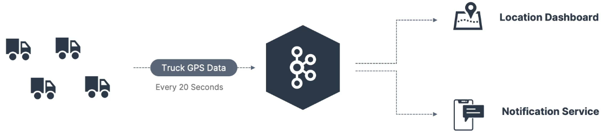

## About The Project

- Apache Kafka Series - Learn Apache Kafka for Beginners v3
- START HERE: Learn Apache Kafka 3.0 Ecosystem, Core Concepts, Real World Java Producers/Consumers & Big Data Architecture
- [Stephane Maarek ](https://github.com/simplesteph)
- [Original Repo](https://github.com/conduktor/kafka-beginners-course)
- [conduktor](https://www.conduktor.io/)
- [Course Resources](https://www.conduktor.io/apache-kafka-for-beginners)

&nbsp;

---

&nbsp;

## Introduction

- If you have 4 **source systems**, and 6 **target systems**, you need to write 24 **integrations**
- Each integration comes with difficulties around
  - **Protocol:** how the data is transported (TCP, HTTP, REST, FTP, JDBC)
  - **Data format:** how the data is parsed (Binary, CSV, JSON, Avro, Protobuf)
  - Data schema & evolution: how the data is shaped and may change
- Each source system will have an increased load from the connections

&nbsp;

## Use-cases

- **Kafka is only used as a transportation mechanism**
- Messaging System
- Activity Tracking
- Gather metrics from many different locations
- Application Logs gathering
- Stream processing (with the Kafka Streams API for example)
- De-coupling of system dependencies
- Integration with Spark, Flink, Storm, Hadoop, and many other Big Data technologies
- Micro-services pub/sub

&nbsp;

---

&nbsp;

### Topics

- A particular stream of data
- Like a table in a database (without all the constraints)
- You can have as many topics as you want
- A topic is identified by its **name**
- Any kind of message format
- The sequence of messages is called a **data stream**
- You cannot query topics, instead, use Kafka Producers to send data and Kafka Consumers to read the data

&nbsp;

---

&nbsp;

### Partitions and offsets

- Topics are split in **partitions**
  - Messages within each partition are ordered
  - Each message within a partition gets an incremental id, called **offset**
- **Immutable**
- Data is kept only for a limited time (default is one week - configurable)
- Offset only have a meaning for a specific partition
  - E.g. offset 3 in partition 0 doesn't represent the same data as offset 3 in partition 1
  - Offsets are not re-used even if previous messages have been deleted
- Order is guaranteed only within a partition (not across partitions)
- Data is assigned randomly to a partition unless a key is provided

- Say you have a fleet of trucksl each truck reports its GPS position to Kafka
- Each truck will send a message to Kafka every 20 seconds, each message will contain the truck ID and the truck position (latitude and longitude)
- You can have a topic `trucks_gps` that contains the position of all trucks
- We choose to create that topic with 10 partitions (arbitary number)

&nbsp;

---

&nbsp;

### Producers and Message Keys

- Write data to topics (which are made of partitions)
- Know to which partition to write to (and which Kafka broker has it)
- In case of Kafka broker failures, Producers will automatically recover
- Can choose to send a **key** with the message (string, number, binary, etc...)
- If `key=null`, data is sent round robin (partition 0, then 1, then 2...)

- **Message Serializer**
  - Kafka only accepts bytes as an input from producers and sends bytes out as an output to consumers
  - Message Serialization means transforming objects/ data into bytes
  - They are used on the value and the key

- **Message Key Hashing**
  - A kafka partitioner is a code logic that takes a record and determines to which partition to send it into
  - **Key Hashing** is the process of determining the mapping of a key to a partition
  - In the default Kafka partitioner, the keys are hashed using the **murmur2 algorithm**, with the formula below for the curious:
    - `targetPartition = Math.abs(Utils.murmur2(keyBytes)) % (numPartitions - 1)`

&nbsp;

---

&nbsp;

## Consumers

- Consumers read data from a topic (identified by name) - pull model
- Consumers automatically know which broker to read from
- In case of broker failures, consumers know how to recover
- Data is read in order from low to high offset **within each partitions**
- Deserialize indicates how to transform bytes into objects/ data
- They are used on the value and the key of the message
- Common Deserializers
  - String (incl. JSON)
  - Int, Float
  - Avro
  - Protobuf
- The serialization/ deserialization type must not change during a topic lifecycle (create a new topic instead)
- All the consumers in an application read data as a consumer groups
- Each consumer within a group reads from exclusive partitions
- It is acceptable to have multiple consumer groups on the same topic
- To create distinct consumer groups, use the consumer property `group.id`

&nbsp;

---

&nbsp;

### Consumer Offsets

- Kafka stores the offsets at which a consumer group has been reading
- The offsets committed are in Kafka topic named `__consumer_offsets`
- When a consumer in a group has processed data received from Kafka, it should be **periodically** committing the offsets (the Kafka broker will write to `__consumer_offsets`, not the group itself)
- If a consumer dies, it will be able to read back from where it left off thanks to the committed consumer offsets
- By default, Java Consumers will automatically commit offsets (at least once)
- There are 3 delivery semantics if you choose to commit manually
  - **At least once (usually preferred)**
    - Offsets are committed after the message is processed
    - If the processing goes wrong, the message will be read again
    - This can result in duplicate processing of messages. Make sure your processing is **idempotent** (i.e. processing again the messages won't impact your systems)
  - **At most once**
    - Offsets are committed as soon as messages are received
    - If the processing goes wrong, some messages will be lost (they won't be read again)
  - **Exactly once**
    - For Kafka -> Kafka workflows: use the Transactional API (easy with Kafka Streams API)
    - For Kafka -> External System workflows: use an idempotent consumer

&nbsp;

---

&nbsp;
